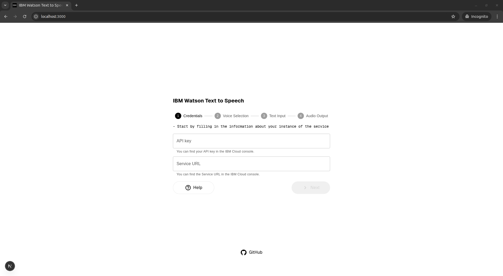
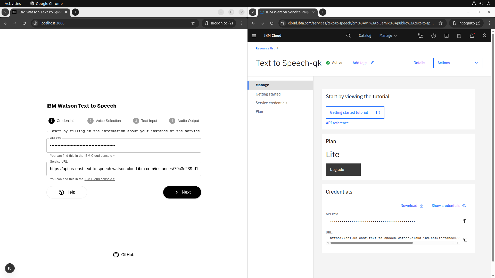
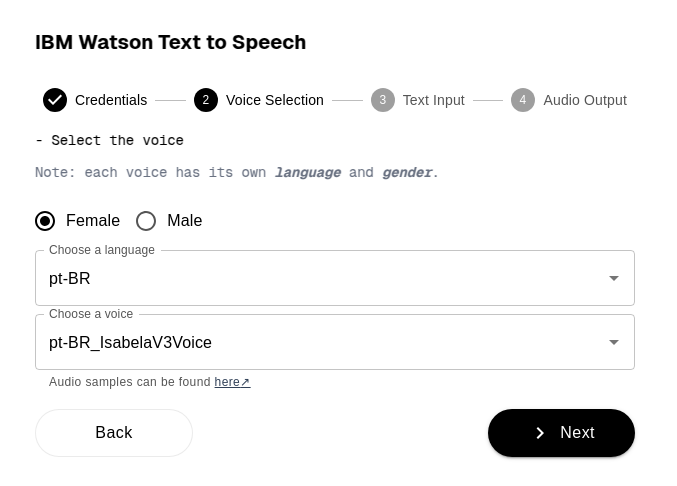
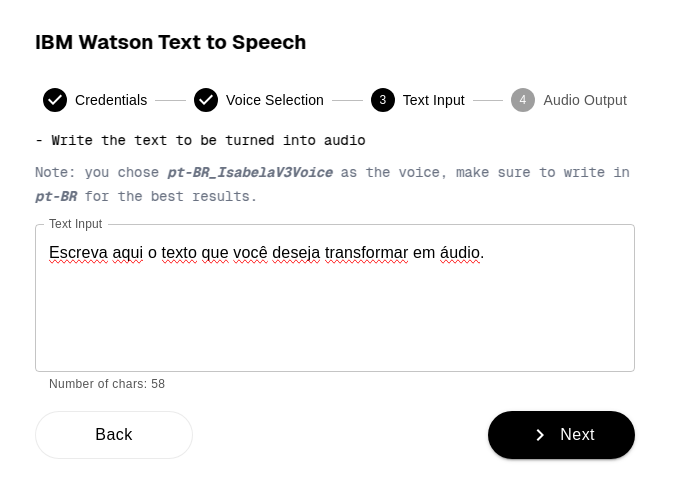
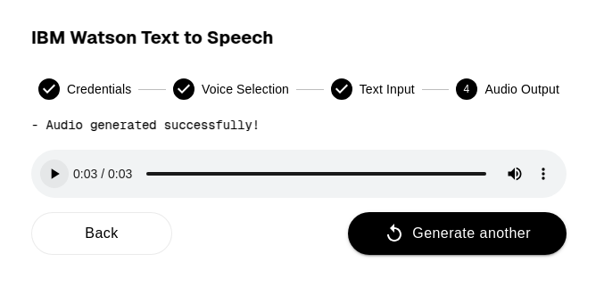

# IBM-Watson-TTS

Aplicação web para interagir com o IBM Watson Text to Speech.

## Requisitos do sistema

Antes de começar, certifique-se de que seu sistema atenda aos seguintes requisitos:

- Node.js 18.18 ou superior
- macOS, Windows (incluindo WSL) ou Linux
- Google Chrome (recomendado)\*

> \* Recomendado para uso da interface gráfica, pois o elemento HTML `<audio />` do Chrome oferece suporte a mais funcionalidades.

## Funcionamento

### 1. Instalação das dependências

Para iniciar a aplicação, instale as dependências executando o seguinte comando no terminal, a partir da raiz do projeto:

```bash
npm install
```

> **Nota:** A instalação pode levar alguns minutos.

### 2. Execução da aplicação

Após a instalação, inicie a aplicação com o comando:

```bash
npm run dev
```

> **Nota:** A aplicação será executada na porta `3000`. Caso ocorra algum problema, verifique se essa porta está livre e se as dependências foram corretamente instaladas.

### 3. Interação

Você pode interagir com a aplicação de duas formas: por meio da interface gráfica ou consumindo diretamente a API.

---

### Utilizando a interface gráfica

Abra o navegador e acesse:

```
http://localhost:3000/
```



Na etapa **Credentials**, informe a chave da API (`apikey`) e a URL do serviço (`serviceUrl`) da IBM Cloud.



Clique em **> Next**.

A aplicação irá consultar a API do IBM Watson para obter a lista de vozes disponíveis.

Na etapa **Voice Selection**, selecione a voz desejada com base no idioma e no gênero.

> **Importante:** Certifique-se de que o idioma da voz corresponde ao idioma do texto, para obter melhores resultados.



Clique em **> Next**.

Na etapa **Text Input**, insira o texto que deseja converter em áudio.

> **Atenção:** O serviço IBM Watson TTS é tarifado com base no número de caracteres. Um contador é exibido no canto inferior esquerdo da tela.



Clique em **> Next** para enviar a solicitação.

O áudio será gerado e disponibilizado para reprodução ou download.



---

### Utilizando a API diretamente

Você também pode interagir com a aplicação enviando requisições HTTP para o endpoint da API. Abaixo está um exemplo utilizando **cURL**.

#### Exemplo com cURL

**Endpoint:**

```
POST http://localhost:3000/api/text-to-speech
```

**Comando:**

```bash
curl -X POST http://localhost:3000/api/text-to-speech \
  -H "Content-Type: application/json" \
  -d '{
    "apikey": "SUA_API_KEY_AQUI",
    "serviceUrl": "SUA_URL_DO_SERVIÇO_AQUI",
    "text": "Olá, este é um teste de voz com o IBM Watson!",
    "voice": "pt-BR_IsabelaV3Voice"
  }' --output audio-output.wav
```

Substitua o valor de `apikey` e `serviceUrl` com base nas credencias da sua instância do serviço.

- O campo `text` contém o texto que será convertido em áudio.
- O campo `voice` deve ser preenchido com uma voz válida disponibilizada pela API (ex.: `pt-BR_IsabelaV3Voice`, `en-US_AllisonV3Voice`).

#### Resposta

A resposta será um arquivo de áudio no formato `audio/wav`, salvo localmente com o nome `audio-output.wav`.

```http
HTTP/1.1 200 OK
Content-Type: audio/wav
Content-Disposition: attachment; filename="audio-output.wav"
```

#### Erros comuns

| Código | Descrição                                    |
| ------ | -------------------------------------------- |
| 400    | Parâmetros `apikey` ou `serviceUrl` ausentes |
| 500    | Erro interno ao tentar sintetizar o áudio    |
